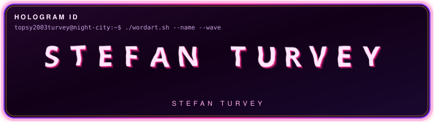

  
   
  
   
  
   
  
   
  
   
  
   
  
    

  
  
  
  

  

    <a href="https://github.com/Topsy2003Turvey">GitHub</a>
    ·
    <a href="https://www.linkedin.com/in/st%C3%A9fan-turvey-2b516128a">LinkedIn</a>
    ·
    <a href="https://stackoverflow.com/users/32764622/topsy2003turvey">Stack Overflow</a>
    ·
    <a href="https://discord.com/users/596042065519837192">Discord</a>
  

